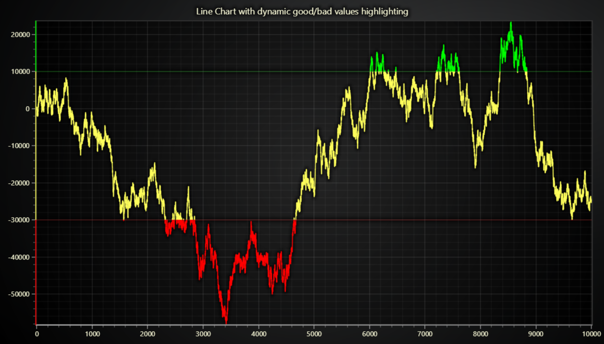

# JavaScript Good/Bad Values Threshold Line Chart

This demo application belongs to the set of examples for LightningChart JS, data visualization library for JavaScript.

LightningChart JS is entirely GPU accelerated and performance optimized charting library for presenting massive amounts of data. It offers an easy way of creating sophisticated and interactive charts and adding them to your website or web application.

The demo can be used as an example or a seed project. Local execution requires the following steps:

-   Make sure that relevant version of [Node.js](https://nodejs.org/en/download/) is installed
-   Open the project folder in a terminal:

          npm install              # fetches dependencies
          npm start                # builds an application and starts the development server

-   The application is available at _http://localhost:8080_ in your browser, webpack-dev-server provides hot reload functionality.

## Description

Example that showcases `LineSeries` feature for coloring line dynamically based on Y coordinates.

This example is based on a completely normal _Line Chart_, where the Y value depicts some trend, such as a stock price, sensor measurement, etc.

Probably the most common need for dynamic Y based coloring comes from scenarios where the values have a range of Bad, Normal and Good values. A practical example could be a greenhouse where the room temperature is measured. For best results, the temperature should stay within acceptable range - neither too cold or too hot.

[//]: # 'IMPORTANT: The assets will not show before README.md is built - relative path is different!'

The dynamic Y coloring feature allows the visualization of this kind of value thresholds very intuitively, by automatically changing color of each data point based on the Y coordinate.

The logic of selecting color based on Y coordinate is done with a _Value - Color lookup table_, a conceptually simple object that can be widely used with many different LightningChart JS components.

The lookup table associates a range of _Values_ with corresponding _Colors_.

[//]: # 'IMPORTANT: The assets will not show before README.md is built - relative path is different!'

Dynamic line coloring is a powerful feature which can serve many different needs. The best thing about it is that it doesn't compromise performance, meaning that you can use it just as well with 100 data points or 100 million data points.

In addition to dynamic coloring by Y coordinate there are also more dynamic coloring modes available:

-   [Line dynamic coloring by X coordinates](https://lightningchart.com/lightningchart-js-interactive-examples/examples/lcjs-example-0050-linePaletteX.html)
-   [Line dynamic coloring by separate Value data set](https://lightningchart.com/lightningchart-js-interactive-examples/examples/lcjs-example-0052-linePaletteValue.html)

## API Links

* [Chart XY]
* [Axis]
* [Line series]
* [Paletted fill]
* [Color lookup table]
* [Color RGBA]
* [Solid fill style]
* [Constant line]

## Support

If you notice an error in the example code, please open an issue on [GitHub][0] repository of the entire example.

Official [API documentation][1] can be found on [LightningChart][2] website.

If the docs and other materials do not solve your problem as well as implementation help is needed, ask on [StackOverflow][3] (tagged lightningchart).

If you think you found a bug in the LightningChart JavaScript library, please contact sales@lightningchart.com.

Direct developer email support can be purchased through a [Support Plan][4] or by contacting sales@lightningchart.com.

[0]: https://github.com/Arction/
[1]: https://lightningchart.com/lightningchart-js-api-documentation/
[2]: https://lightningchart.com
[3]: https://stackoverflow.com/questions/tagged/lightningchart
[4]: https://lightningchart.com/support-services/

© LightningChart Ltd 2009-2022. All rights reserved.

[Chart XY]: https://lightningchart.com/js-charts/api-documentation/v5.2.0/classes/ChartXY.html
[Axis]: https://lightningchart.com/js-charts/api-documentation/v5.2.0/classes/Axis.html
[Line series]: https://lightningchart.com/js-charts/api-documentation/v5.2.0/classes/LineSeries.html
[Paletted fill]: https://lightningchart.com/js-charts/api-documentation/v5.2.0/classes/PalettedFill.html
[Color lookup table]: https://lightningchart.com/js-charts/api-documentation/v5.2.0/classes/LUT.html
[Color RGBA]: https://lightningchart.com/js-charts/api-documentation/v5.2.0/functions/ColorRGBA.html
[Solid fill style]: https://lightningchart.com/js-charts/api-documentation/v5.2.0/classes/SolidFill.html
[Constant line]: https://lightningchart.com/js-charts/api-documentation/v5.2.0/classes/ConstantLine.html

